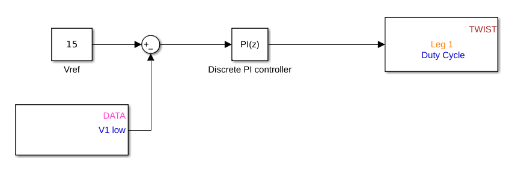

# Closed loop buck 

After the open-loop mode, the aim of this tutorial is to show you how you can implement a buck voltage control using simulink and owntech library.

You can delete all the data store variable related to the duty_cycle that we have created in the open loop section. Enter inside the block closed_loop_task, and with the association of the block “constant”, “sum” and “discrete PID controller” from the simulink library, `set leg duty` and `get data` from owntech library you can create the following schema :

We are fixing the output voltage to 15 volt, as for the PI paramters you should have the same as below :

 

Then generate the code, matlab will upload it automatically to the board :

Finally, switch to ownplot, open the correct port and send the matlab_mode to execute the generated code :

When enabling the matlab_mode, the output voltage will be fixed to 15V.