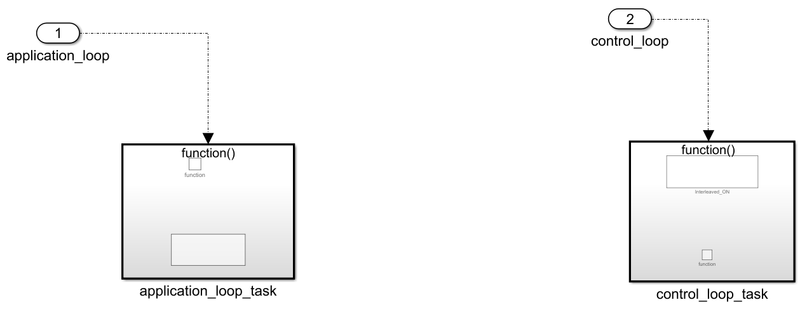
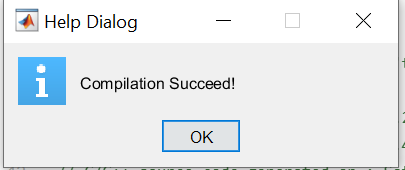

# First compilation with matlab

## Owntech blocksets 

There is a set of simulinks blocks ready to be used, to install it first clone this [repository](https://gitlab.laas.fr/owntech/owntech-matlab.git) and checkout to the branch Ownblock_library_V3. In a console use the commands : 

```shell
git clone https://gitlab.laas.fr/owntech/owntech-matlab.git
git checkout Ownblock_library_V3
```
=== " "
    { width=300 align=left }

    In the folder where the repository is cloned, you will find a file with the extension **.mtltbx** which is a matlab toolbox. There are multiple toolbox, choose the one correspondings to your OS and open it with matlab (in matlab press `ctrl+o` then open the chosen file), and the toolbox will be installed automatically.

    After the installation you can check that the library has been correctly installed. In simuinks "Library Brower" you can see if Owntech Library is present.


## Simulink template

Still in the folder where we cloned the [repository](https://gitlab.laas.fr/owntech/owntech-matlab/-/tree/matlab_zephyr) checkout to the branch matlab_zephyrV3 :

```shell
git checkout matlab_zephyrV3
```

``` title="Resulting folder file structure"
├── LICENSE
├── matlab_file
├── owntech
├── platformio.ini
├── README.md
├── src
└── zephyr
```

=== " "
    { width=300 align=left }

    Make sure that your working directory in matlab is the folder `matlab_file`. Browse for the folder in matlab.

    In matlab_file, there is a simulink file (owntech_template.slx) already set to be used for code generation. Open it and let’s take a look at what is inside :

{ width=300 }

Let's see how each of this blocks work, starting by the initialize block.


=== "Initialize block"
    { width=200 align=left}

    This block will generate the initialization step for the hardware and software configuration. You can choose the convention for the legs (buck, boost) and the version of the board.


You can left it as it is to continue with the default value. 


=== " Increase/decrease functions and pwr_enable state "
    { width=300 align=left }

    Inside the simulink file, we can see two functions that you can use to increment or decrement variables that you have defined. We will see how to use them later in another section of this tutorial. You can also notice that there is a variable pwr_enable, the state of this variable is used to activate or deactivate the PWM command of the converters.


=== " The application task and the control loop "
    { width=300 align=left }

    We have two blocks here, we will focus on them to generate our code. The first one is the application_loop_task which works at a period of 100ms. Currently it is empty, but it will allow us later to define voltage reference and duty cycle here. 

=== " "
    { width=300 align=left }

    On the other hand the control_loop_task is faster, and works at 10kHz. We will typically use this block for all the critical tasks (sending the pwm command, PID implementation..). For now, the control_loop blocks contains a block called Interleaved_ON and depending on the value of pwr_enable, this block is supposed to activate the converter drivers. This block is currently commented to not activate the converter, we will uncomment it later on this tutorial.  


    This concludes the presentation of the simulink template, before generating any code we will need to make some configuration with the serial monitor to visualize data and also send commands.

## Serial monitor setting

If you check the main file (main.cpp) in the src folder, you will notice that we have essentially two modes :

```cpp 

enum serial_interface_menu_mode //LIST OF POSSIBLE MODES FOR THE OWNTECH CONVERTER
{
    IDLEMODE =0,
    MATLABMODE

};
```

The idle mode will turn off the PWM signal sent to the converters, while the matlab mode will execute the generated code. If you look at the loop_communication_task inside the main file, you will see all the commands needed to activate either the idle mode or the matlab mode, but also to use the increase `Up_function()` and decrease `Dwn_function()` functions defined in the simulink template. For example, if we send “m” to the serial monitor, we will switch to the matlab mode.


```cpp title="different modes and command to send"
void loop_communication_task()
{
    while(1) {
        received_serial_char = console_getchar();
        switch (received_serial_char) {
            case 'h':
                //----------SERIAL INTERFACE MENU-----------------------
	            printk(" ________________________________________\n");
                printk("|     Communication task Tutorial        |\n");
                printk("|     ------- MENU ---------             |\n");
                printk("|     press i : idle mode                |\n");
                printk("|     press m : matlab generated code    |\n");
                printk("|     press u : increment variable       |\n");
                printk("|     press d : decrement variable       |\n");
                printk("|________________________________________|\n\n");
                //------------------------------------------------------
                break;
            case 'i':
                printk("idle mode\n");
                mode = IDLEMODE;
                break;
            case 'm':
                printk("Matlab generated code\n");
                mode = MATLABMODE;
                break;
            case 'u':
                printk("increase!\n");
                Up_function();
                break; 
            case 'd':
                printk("decrease!\n");
                Dwn_function();
                break;    
            default:
                break;
        }
    }
}
```

We will use ownplot as a serial monitor, go to this [github page](https://github.com/owntech-foundation/OwnPlot).

Then click on release :


Depending on your OS, choose the correspondig binary file and download it : 


Execute the binary file to launch ownplot, start it and open the “send” tab. First we will set the commands.

=== " "
    { width=300 align=left }

    In (1) enter the command’s name (eg: decrease), in (2) the data associated to this command that we will send and finally press (3) to save the command. Repeat this process three time for the other command (idle-i, matlab_mode-m and increase-i).


=== " "
    { width=300 align=left }

    In the “setting” tab, check that you have the same parameters.

=== " "
    { width=300 align=left }

    With the serial monitor we can visualize current and voltage from the sensor, in the “chart” tab rename the dataset to have the following names in exactly the same order


## Adding platformIO command to the system path

 This process depends on your OS: 

=== "Windows"
    It is necessary to add C:\\Users\\ **user** \\.platformio\\penv\\Scripts (user is your user name on the computer) to your system path. We recommend that you follow this [guide.](https://www.architectryan.com/2018/03/17/add-to-the-path-on-windows-10/)

=== "Linux"
    You can call this command from matlab command window: `setenv("PATH",[getenv("PATH"),':/home/username/.platformio/penv/bin'])` Where home is your home directory and username is your user name. If your platformio is installed somewhere else, please change this path.


You are now all set to generate your first code !

## How to generate

We can try to compile and flash the board with this empty template to make sure that embedded coder work. 

Go to the app tab and then select Embedded Coder :

 


=== " "
    { width=300 align=left }

    After the code generation, matlab will automatically flash the code to the board. If everything went well, you should see this window appears :

    If not, make sure that your current working directory is matlab_files, that the board is turned on and connected to your computer or that you have added “C:\\Users\\user.platformio\\penv\\Scripts” to the system path.