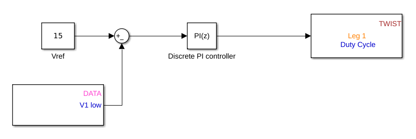

# Gettings started with matlab 

Matlab with the Embedded Coder add-on, is employed in the embedded field to generate code directly from Simulink blocksets. By integrating Owntech APIs as blocksets, the Embedded Coder allows you to accelerate the code generation process from your Simulink designs.

_Image : Example of implementation of PID with Owntech Blockset in Simulink_

Owntech blocksets might be useful for you if:

-    You work in fields like research and development, simulation, or other areas where Matlab/Simulink is used regularly.
-    You are interested in quickly generating and deploying code using Simulink blocksets and the Embedded Coder add-on.

# Prerequisites

It is not required, but you can try to follow first this [tutorial](https://github.com/owntech-foundation/Tutorials/wiki) to become familiar with owntech hardware and software.

## Hardware

- A Twist power board
- A 50V power supply
- A resistive load (like an electronic load, or a variable resistive load)

## Software

- Matlab-Simulink, with embedded coder add-on

- Visual Studio Code with PlatformIO, refer to the tutorial

- Git