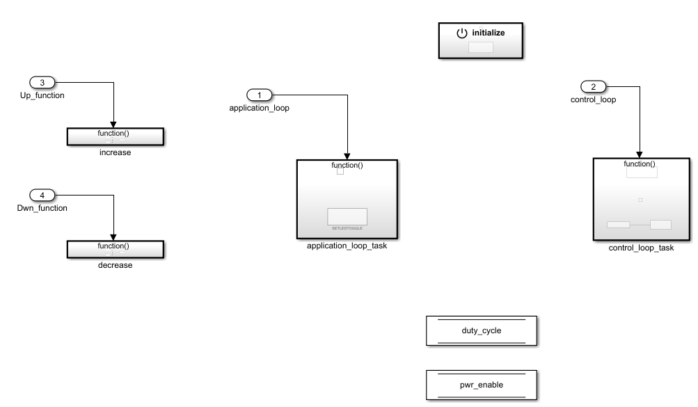

# Open loop buck control

This section of the tutorial will show you how you can generate a code to control the converter in open-loop mode with the simulink template.

First let’s start by creating a variable which will represents the duty cycle. Take a “data store memory” block from simulink, to the root (where pwr_enable is located).

Name this data store block duty_cycle, and in the signal attribute tab choose the initial value (0.5 here to have 50% duty cycle) and data type (double or float):

=== " "
    { width=400 align=left }

    Then enter inside the increase function block, take a “data store read” and a “data store write” from simulink library and link them with duty_cycle (name them duty_cycle). With the association of the “constant” and “add” block from simulink you can form the following schema.

=== " "
    { width=300 align=left }

    You can do the same thing in the decrease function block, instead of an addition it will be a subtraction.

You have now the possibility to control the duty_cycle either by increasing or decreasing it, the only thing missing is sending this value to the converters. Inside control_loop_task, we will first uncomment the `POWER_ON` to activate power : click on the block then press ctrl+shift+x. We will then place a “data store read” block linked to duty_cycle and a `set leg duty` block connected together.

Then generate the code, matlab will upload it automatically to the board :

Finally, switch to ownplot, open the correct port and send the matlab_mode to execute the generated code, use increase and decrease function to control the duty cycle :

